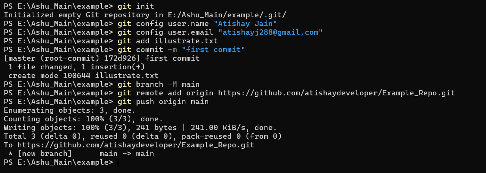
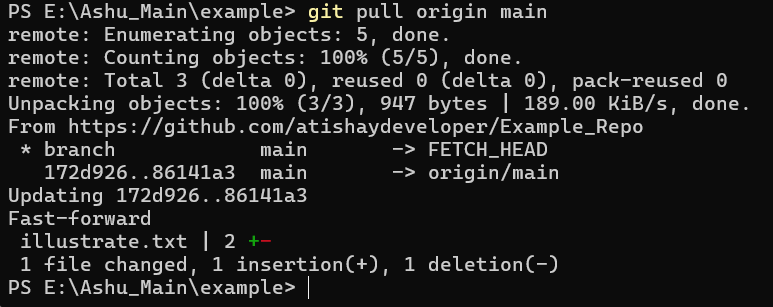
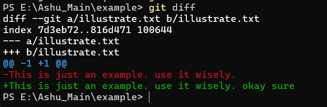
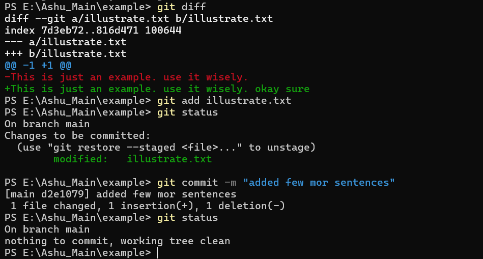
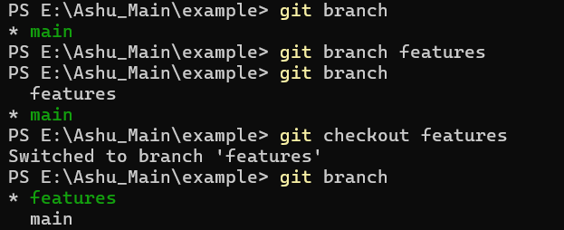
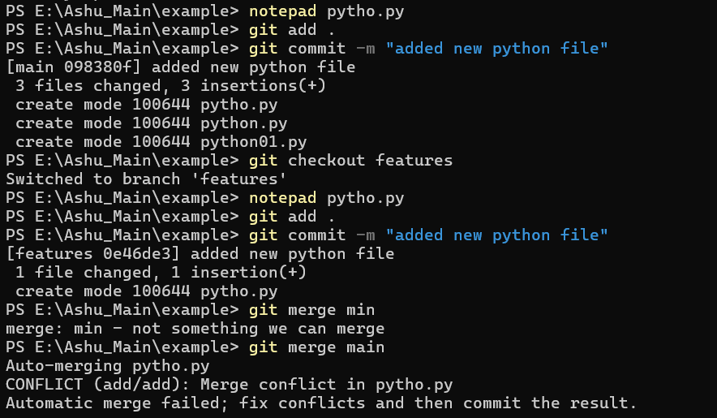
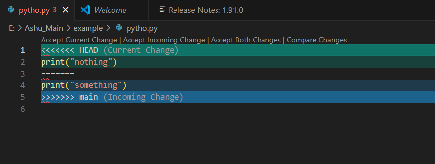
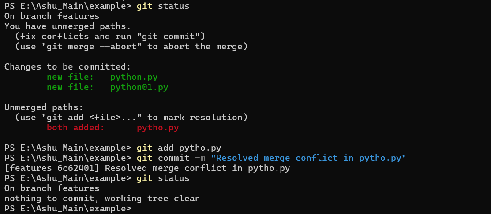

# Git Setup and Operations

An overall overview of Git setup commands and operations. This file consists of detailed steps to setup a git environment, how to commit changes, merge operations, push and pull requests, create a branch and many more.

## Key Takeaways

1. Git Commands
2. Repository creation and Initialization
3. Configuration
4. Tracking
5. Managing branches
6. Resolving Merge related issues
7. Collaboration
8. History management

## Types of Version Control System in Git
1. ### Local Version Control Systems
It is one of the simplest forms and has a database that kept all the changes to files under revision control. RCS is one of the most common VCS tools. It keeps patch sets (differences between files) in a special format on disk. By adding up all the patches it can then re-create what any file looked like at any point in time. 

2. ### Centralized Version Control Systems
Centralized version control systems contain just one repository globally and every user need to commit for reflecting one’s changes in the repository. It is possible for others to see your changes by updating. 

Two things are required to make your changes visible to others which are:  

- You commit
- They update

3. ### Distributed Version Control Systems
Distributed version control systems contain multiple repositories. Each user has their own repository and working copy. Just committing your changes will not give others access to your changes.

To make your changes visible to others, 4 things are required:  

- You commit
- You push
- They pull
- They update

## The 3 stages of Git
- Untracked: the file exists, but is not part of git's version control.

- Staged: the file has been added to git's version control but changes have not been committed.

- Committed: the change has been committed.

## Git Commands Overview

- **Initialization**: Learn how to set up a new Git repository with `git init`.
- **Configuration**: Configure user information and preferences with `git config`.
- **Status**: Check the status of your working directory and staging area with `git status`.
- **Add Commands**: Stage changes for the next commit using `git add`.
- **Commit**: Save your staged changes with a descriptive message using `git commit`.
- **Log**: View the history of commits in your repository with `git log`.
- **Diffing**: Compare changes in your working directory with `git diff`.
- **Branch**: Create, list, and manage branches with `git branch`.
- **Checkout**: Switch between branches or restore files with `git checkout`.
- **Merge**: Combine changes from different branches into a single branch with `git merge`.
- **Remote**: Manage remote repositories and connections with `git remote`.


## Use Commands with Scenarios

### Scenario 1 : Push
Suppose we want to push our folder (named as "example") consists of a file(named as "illustrate.txt") stored in one of our computer drive to git hub as a repository, then it can be achieved by the following GIT commands and operations as given in steps below:

Step 1: Open the Command Prompt.

Step 2: Select the directory in which you want to work in.

Step 3: Initialize the git hub repository 

To initiate run

```bash
  git init
```
Step 4: run the following command for configuration (enter your own user name and email)

```bash
  git config user.name "<name>"

```
```bash
  git config user.email "<email>"
```
Step 5: run the following command to stage changes you've made to your project's files, preparing them to be included in the next commit.

```bash
  git add illustrate.txt
```
Step 6: run the following command to take all of the changes that have been made locally and push them up to a remote repository.

```bash
  git commit -m "first commit"
```
Step 7: run the following command to create a branch for our repository.

```bash
  git branch -M main
```
Step 8: Go to the git hub web page and login with your ID and password. Navigate to the home page. Then click on *New* button to create a new repository.

Step 9: Give a suitable name for the respository (in my case: "Example_Repo") and leave the rest as it is.

Step 10: run the following command to push the commits in the local branch named master to the remote named origin. It is used to add a repository.(the url for your own git hub environment can be accessed after the creation of new repository)

```bash
  git remote add origin https://github.com/atishaydeveloper/Example_Repo.git
```
Step 11: The following command is used to send your local commits on the main branch to the remote repository named origin.

```bash
  git push origin main
```
(at this stage after running the code above, it might ask you to enter your git hub user ID and password. Hence for privacy create a token of git hub to enter password instead of actual one)

## After Code Illustration



### Scenario 2 : Pull
Suppose we want to pull the changes made in our git hub repository, then following steps are as following (here I modified the "illustrate.txt" file):

Step 1: In the same command prompt and in the same *example* directory, run the following code.

```bash
  git pull origin main
```
## After Code Illustration



### Scenario 3 : Diffing
Suppose we modified our "illustrate.txt" file in the working directory, now we need to see the changes made in the file. This can be done by the following code:

Step 1: In the same command prompt and in the same *example* directory, run the following code.
(currently our file is in unstaged condition)



```bash
  git diff
```
Step 2: To stage the file run the below code.

```bash
  git add illustrate.txt
```
Step 3: Now to check the state of the file we use the code below.

```bash
  git status
```
It will show our status that changes yet to be committed, as you can see in the picture.

Step 4: Now to commit changes we need to run below code.

```bash
  git commit -m "added few mor sentences"
```
Step 5: Again check the status.

```bash
  git status
```
a message will occur as - nothing to commit.

## After Code Illustration



### Scenario 4 : Branch 
Till now we are working with "main" branch which is also known as master branch. But now we want to use another branch (named as features) instead of th main branch. To achieve this we need to follow these steps:

Step 1: Run the following command to create new branch.

```bash
  git branch features
```
Step 2: To switch between the branches use this command.

```bash
  git checkout features
```
Step 3: to check number of available branches, we can use this command.

```bash
  git branch
```

## After Code Illustration



### Scenario 5 : Merge 
The git merge command is used to combine changes from one or more branches into the current branch. Now we have created two python files with same name (here named as "pytho.py") for the two branches - one is for the main branch and the another one is for features branch. after using the merge function as shown below:

```bash
  git merge main
```
we are getting a merge conflict as portrayed in the image. To address such a conflict, following steps should be followed.


Step 1: Check the status of the branches.

```bash
  git status
```
It will show an error of unmerged paths. Such an error can only be dealt manually. 

Step 2: Open the conflicted file (pytho.py in this case) in your preferred text editor. You will see conflict markers like as shown below.



Step 3: Remove the "<<<<<<<", "======", ">>>>>>>" signs and also combine the changes as needed.

```bash
# Combine or choose the appropriate changes from both branches
Resolved content of the file
```
Step 4: Add the resolved file.

```bash
  git add pytho.py

```
Step 5: Commit the merge.

```bash
  git commit -m "Resolved merge conflict in pytho.py"


```
Step 6: Verify the merge.

```bash
  git status


```
your conflict will be resolved.

## After Code Illustration



# Thank You for following till last